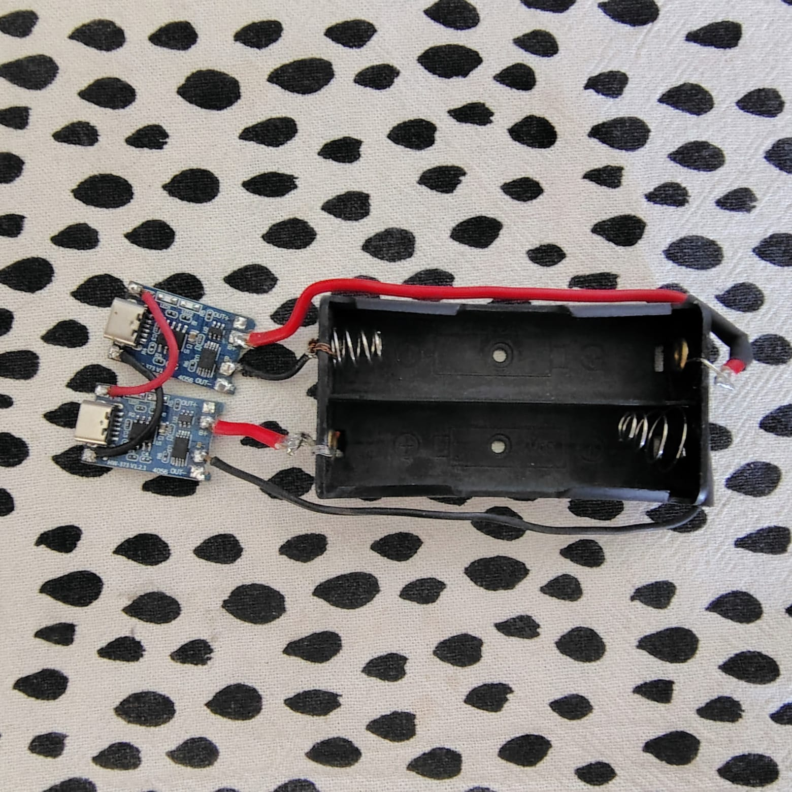
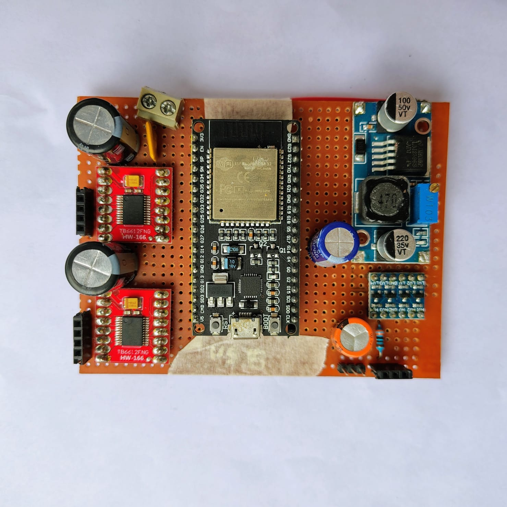
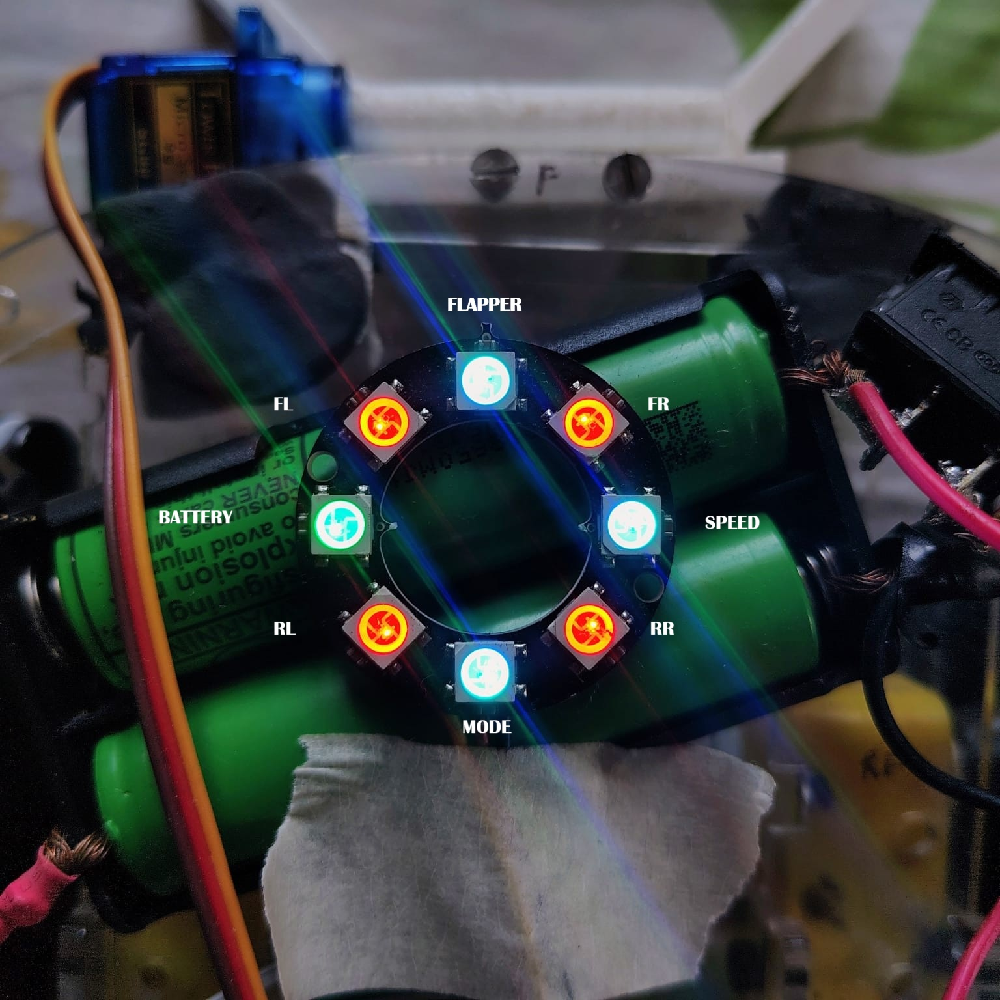
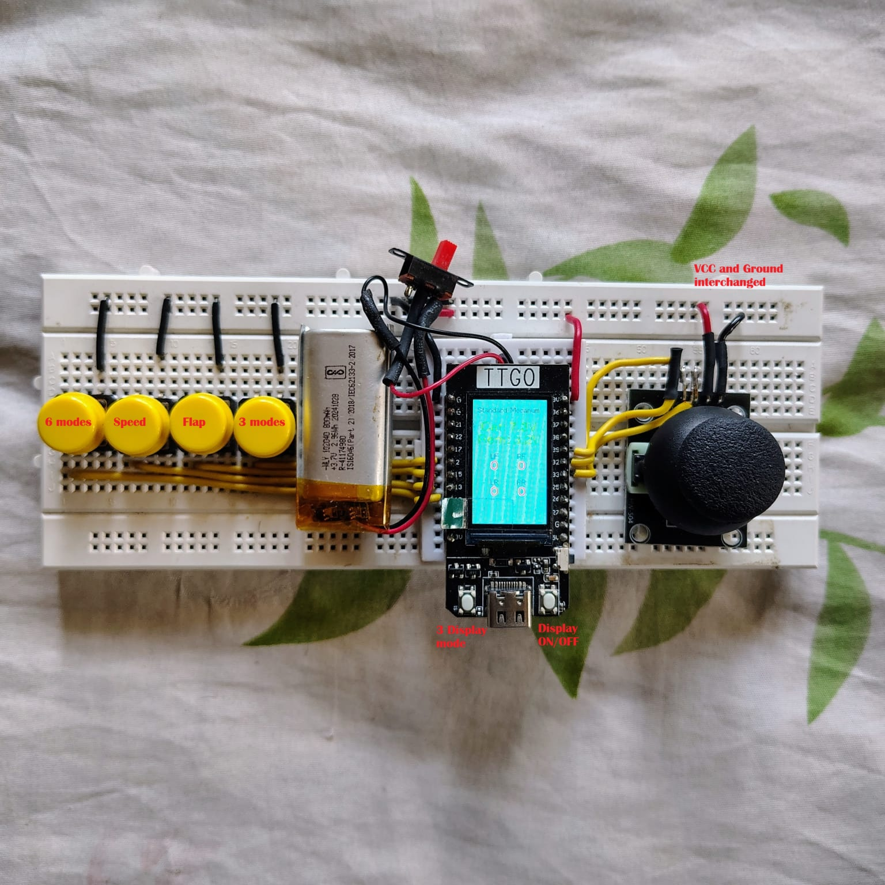
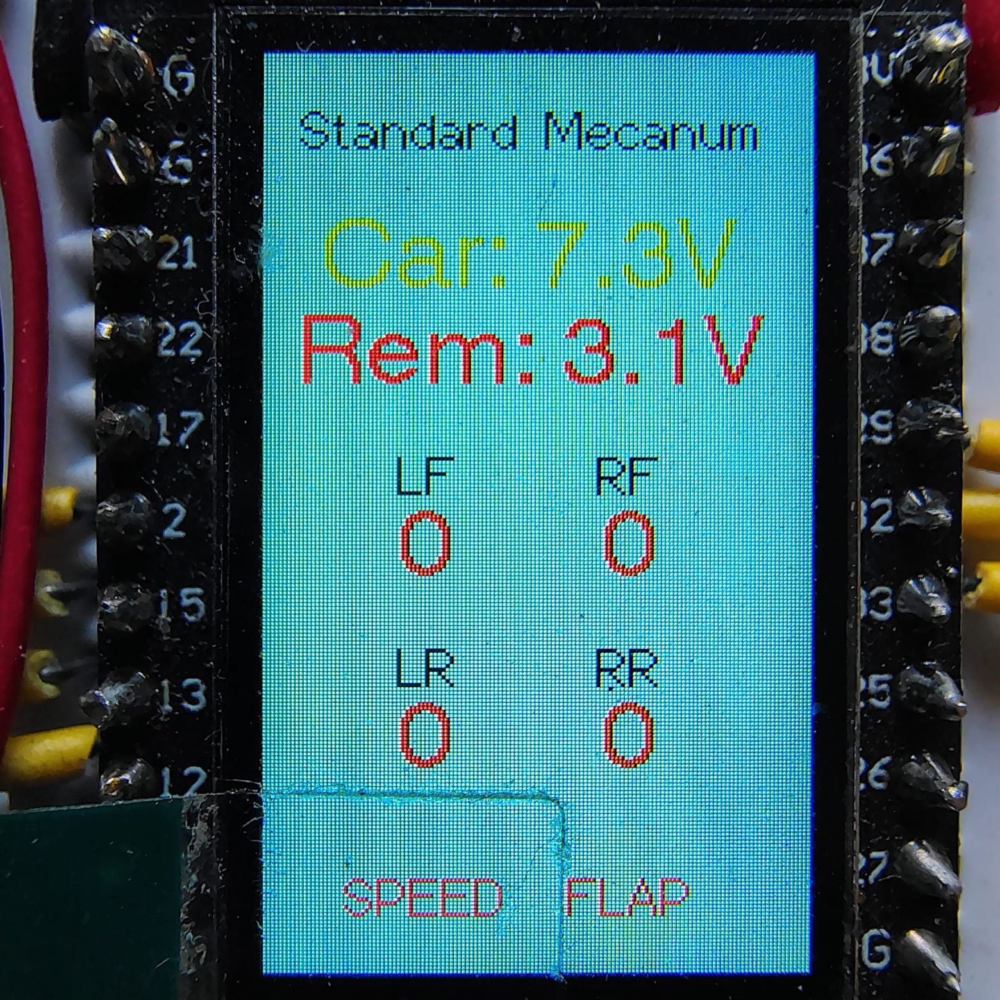
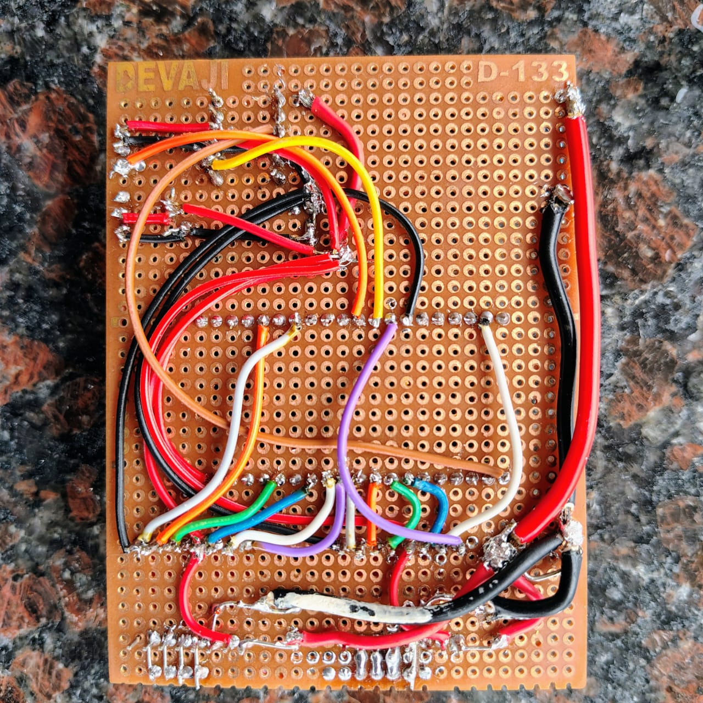
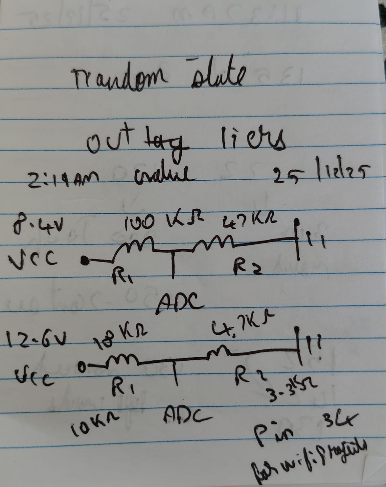
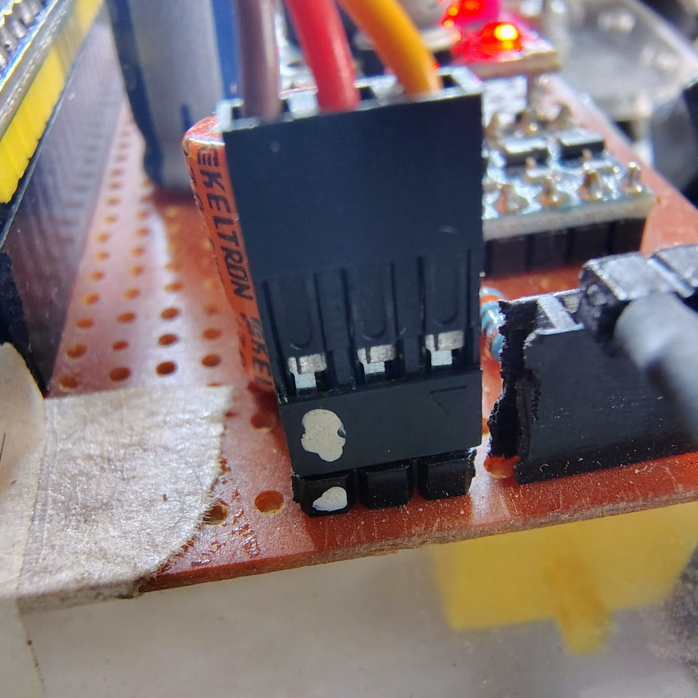

# Build Log & Documentation

## 📝 Project Overview

This is a derived and enhanced version of the Mecanum Wheel Robot Car originally designed by [DroneBot Workshop](https://dronebotworkshop.com). The original tutorial provided an excellent foundation, and this build includes several modifications and improvements based on real-world testing and usage.

**Original Tutorial:** [DroneBot Workshop - Mecanum Wheel Robot Car](https://dronebotworkshop.com/mecanum/)

> **Special Thanks:** A huge thank you to DroneBot Workshop for the comprehensive tutorial and detailed explanations that made this project possible!

#### **Another valuable resource** [IITM Student Outreach Program](https://drive.google.com/drive/folders/1NdA0Y0AUDSWe7Uvx9wfMEFJxht2Ays-z)

#### **People who help me make this into a reality**
  - Sajeev
  - Nisha
  - [Tejassh](https://github.com/TejazerX)
  - [Aditya](https://www.linkedin.com/in/aditya-mahto-55274b391/)
  - Diya ma'am
  - Jinesh sir
  - Nandana
  - [Aditya](https://www.linkedin.com/in/adityaraoiitm/)
  - [Phil](https://www.printables.com/@PhilM)

---

## 🛠️ Build Process & Modifications

### Mechanical Components

#### Frame & Chassis
- **Material:** Laser-cut acrylic/MDF panels
- **Process:** 
  - Designed frame layout for mecanum wheel configuration
  - Sent design for laser cutting service
  - **Required extensive sanding** of all cut edges to remove char marks and ensure smooth finish
  - Assembly with M3 standoffs (I wasn't able to get M3 standoffs so used 10mm screws and nuts) and screws
- **File:** [I didn't design it, got it from Phil M](https://www.printables.com/model/186945-4wd-buggy-chassis-arduino)

**💡 Recommendation:** Consider purchasing a **pre-made mecanum wheel car kit** instead of sourcing individual components. It's often:
- **Cheaper** than buying parts separately
- Comes with properly fitted parts
- Saves significant time on fabrication
- Eliminates alignment issues

Popular kit options:
- 4WD Mecanum Wheel Robot Car Kit (various sellers on AliExpress, Amazon, robu, makerbazar)
- Pre-assembled chassis with motor mounts
- Often includes motors and wheels
- Also the fittings, the screws and nuts are quite difficult to source by themself especially locally and they are more expensive too.

#### Custom 3D Printed Parts

##### 1. Motor-to-Wheel Coupler
- **Purpose:** Connect DC motors to mecanum wheel hubs
- **Material:** PLA/PETG
- **Print Settings:**
  - Layer height: 0.2mm
  - Infill: 50-80% (needs to handle torque)
  - Supports: Required for shaft interface
  - Print orientation: it in a horizontal manner as i had issues of it snapping off due to torque. 
  
**Issues Faced:**
- Initial couplers were too tight - had to sand down motor shaft interface
- Wheel wobble due to loose fit - added plumbers tape for grip
- Kept on breaking so applied M-Seal will have to fix it as the wheels aren't oriented straight.

**Files:** `3D_Models/motor_coupler.stl`  [I didn't design this,got them for IITM School connect course curriculum](https://drive.google.com/file/d/1HanFR_hteSeybVQaEPewp7Q1eFs2xh4M/view?usp=drivesdk)

##### 2. Servo Flapper Mechanism
- **Purpose:** Ball kicking mechanism mounted on servo
- **Design:**
  - Servo horn attachment point
  - Extended arm for reach
  - Reinforced impact surface
- **Material:** PETG (more flexible and impact-resistant than PLA)
- **Print Settings:**
  - Layer height: 0.2mm
  - Infill: 80% (needs strength for impacts)
  - Print orientation: Flat to ensure layer strength perpendicular to impact

**Issues Faced:**
- PLA version cracked after repeated impacts - switched to PETG
- Initial design too long - reduced servo strain by shortening arm
- Servo jitter under load - adjusted PWM frequency

**Files:** `3D_Models/flapper_arm.stl` *This is my first model so there are lots of problems, shall update it in future*

[Body](https://github.com/sanjayingithub/mecanum-robot-car/blob/main/3D_Models/flapper_body.stl)
[Flapper](https://github.com/sanjayingithub/mecanum-robot-car/blob/main/3D_Models/flapper.stl)

---

## ⚡ Electronics Assembly

### Power Distribution
- **Main Battery:** 2S Li-ion (7.4V, 2200mAh recommended)
- **Issue:** Initial setup had voltage drop under load
  - **Solution:** Added capacitors (470µF) near motor drivers
  - Used thicker gauge wires (18 AWG) for motor power

### Motor Drivers
- **Used:** 2x TB6612FNG modules
- **Mounting:** designed the entire thing on a protoboard

### LED Wiring
- **Critical Issue:** Added 220Ω resistor in NeoPixel power rail thinking it was needed
  - **Problem:** Caused voltage drop affecting blue channel brightness
  - **Solution:** Removed resistor - NeoPixels work best with direct 5V connection
  - **Lesson:** Always check component datasheets before adding "protective" components

### Servo Integration
- **Flapper Servo:** Connected to Pin 18
- **Power:** Direct from battery through servo connector
- **Issue:** Servo buzzing at idle
  - **Solution:** Adjusted duty cycle calculation for 0° position
  - Used 16-bit LEDC resolution for smoother control

---

## 🎨 Aesthetics & Finishing

### Sanding of motor mounts and 3d prints
- **Time Required:** Approximately 3-4 hours for all laser-cut parts
- **Tip:** Wet sanding works better for acrylic, prevents melting from friction

### LED Brightness Tuning
- **Initial:** Full brightness (255 RGB values)
- **Problem:** Way too bright, uncomfortable to look at
- **Solution:** Reduced to 20% brightness (51 RGB values)
- **Result:** Easier on eyes while maintaining visibility

---

## 📸 Build Photos

### Assembly Stages

#### 1. Charger

- Its basically TP4056 and a battery holder
- 2 of the modules are connected in parallel
- The modules doesn't have [5.1K 1% resistors in CC lines](https://forum.digikey.com/t/simple-way-to-use-usb-type-c-to-get-5v-at-up-to-3a-15w/7016) so a type A to type C cable will only work as it doesn't support PD

#### 2. Electronics Layout

- Motor drivers positioned
- ESP32 mounted
- Wiring harness layout

#### 3. LED Neopixel

- NeoPixel ring placement

#### 4. Flapper Mechanism

- 3D printed flapper arm
- Servo mounting

#### 5. Completed Build - Top View

- Fully assembled robot
- All components in place

#### 6. Completed Build - Side View

- Ground clearance

#### 7. Remote Control

- TTGO T-Display with joystick
- Button layout

#### 8. Action Shots

- Robot in motion
- LED indicators active
- Flapper mechanism deployed

#### 9. Display

- This is the default mode the other 2 are same as Dronebotworkshop
- The title and background color changes in differnt modes
- The colour of motor postion changes with direction and values change with speed
- Lower corner shows the indication of Speed and flapper modes

#### 10. Wiring

- This is my first experience with protoboarding
- The soldering works even though it look like a piece of crap
- This was taken before adding the voltage divider

#### 11. Resistive divider

- The first resistor values are being used here as 2 18650 batteries are only used
- If you decide to go with 3 18650 in series use the second resistor values

#### 12. Pin marking

- Used a combination of whitener and nail polish to oriet and connect the wires.

---

## 🐛 Issues Encountered & Solutions

### Hardware Issues

#### 1. Motor Alignment
**Problem:** Mecanum wheels not driving straight
- **Cause:** Uneven motor mounting, wheels not perfectly perpendicular
- **Solution:** 
  - The plan is it print the couplers again and tweak the design and motor mounting method.
  - If that that doesn't work might implement software based solutions.

#### 2. Wheel Wobble
**Problem:** Visible wobble in wheels during rotation
- **Cause:** Loose coupler fit
- **Solution:**
  - Redesigned couplers with tighter tolerances
  - Used plumbers tape for vibration dampening
  - Checked motor shaft straightness before installation

#### 3. Protection
**Problem:** Over current draw
- **Cause:** Short circuit
- **Solution:**
  - RUSBF250 16V 2.5A Tyco Raychem PPTC resettable fuse
  - Added series to the battery
  - Cuts off it too much current is drawn

### Software Issues

#### 4. LED Flickering (Flapper Indicator)
**Problem:** LED status not staying on during flapper activation
- **Cause:** Status update function overwriting LED every loop
- **Solution:** 
  - Added state protection in `setLedStatus()`
  - Continuous LED state refresh in `flapper()` function
  - Separate LED control during kick/cooldown states

#### 5. Color Synchronization
**Problem:** Car LED colors didn't match remote display
- **Cause:** Different mode-to-color mappings between devices
- **Solution:** Standardized color scheme across both programs

#### 6. Blue Channel Dimness
**Problem:** Blue LEDs appeared significantly dimmer than red/green
- **Initially thought:** LED characteristic issue
- **Actual cause:** 220Ω resistor in power rail causing voltage drop
- **Solution:** Removed resistor, blue channel returned to normal

### Communication Issues

#### 7. ESP-NOW Connection Drops
**Problem:** Intermittent disconnections during operation
- **Cause:** WiFi interference, power supply instability
- **Solution:**
  - Disabled WiFi sleep mode: `WiFi.setSleep(false)`
  - Added watchdog timer for system recovery
  - Implemented proper timeout handling (500ms)

#### 8. Joystick Drift
**Problem:** Car slowly drifting even with joystick centered
- **Cause:** Analog joystick calibration, electrical noise
- **Solution:**
  - Implemented deadzone (±200 ADC counts) in `convertJoystickValues()`
  - Software filtering for stability

---

## 💡 Recommendations & Tips

### For Future Builders

#### 1. **Buy a Kit Instead of Individual Parts**
   - **Cost:** Often 30-50% cheaper than sourcing separately
   - **Time:** Saves weeks of waiting for parts from different suppliers
   - **Quality:** Parts designed to work together
   - **Less headache:** No compatibility issues

#### 2. **3D Printing Tips**
   - Print couplers with high infill (80%+) for strength
   - Use PETG for impact parts (flapper)
   - Print orientation matters - consider layer strength
   - Keep spare printed parts for quick replacement

#### 3. **Electronics Assembly**
   - **Test components individually** before final assembly
   - Use JST connectors for easy disconnect/reconnect or go cheap with berg at your own risk
   - Label all wires (seriously, do this!) nail polish could also work
   - Take photos during assembly for reference

#### 4. **Power Management**
   - Use proper capacity battery (2200mAh minimum) 
   - Add voltage monitoring early in development
   - Include power switch in accessible location
   - Consider adding a fuse for protection
   - Don't buy those cheap knock off batteries use name brand once

#### 5. **LED Brightness**
   - Start with low brightness (20-30%) and increase if needed
   - Much easier to increase than decrease
   - Consider ambient lighting conditions

#### 6. **Software Development**
   - Use version control (Git) from the start
   - Comment your code thoroughly
   - Test each feature independently
   - Keep a changelog of modifications

---

## 🔮 Future Enhancements

### Planned Upgrades
- [ ] Add IMU (MPU6050) for stability control
- [ ] Implement PID speed control for accurate movements
- [ ] Add ultrasonic sensors for obstacle detection
- [ ] Create autonomous navigation mode
- [ ] Add FPV camera module
- [ ] Implement mobile app control (Bluetooth/WiFi)
- [ ] Add line-following capability
- [ ] Improve battery life optimization

### Ideas Under Consideration
- Additional servo for grabber arm
- Encoder-based odometry
- Custom PCB to consolidate wiring

---

## 📚 Resources & References

### Original Tutorial
- **DroneBot Workshop:** https://dronebotworkshop.com
- YouTube tutorial series on mecanum wheel robots
- Excellent explanations of mecanum wheel mathematics

### Libraries Used
- **NeoPixelBus** by Michael C. Miller: https://github.com/Makuna/NeoPixelBus
- **TFT_eSPI** by Bodmer: https://github.com/Bodmer/TFT_eSPI
- **ESP-NOW** documentation: https://docs.espressif.com/projects/esp-idf/en/latest/esp32/api-reference/network/esp_now.html

### Helpful Resources
- ESP32 pinout reference
- Mecanum wheel kinematics tutorials
- PlatformIO documentation
- WS2812B datasheet

---

## 📞 Contact & Contributions

This project is open source and contributions are welcome!

**Found an issue?** Open an issue on GitHub
**Have improvements?** Submit a pull request
**Questions?** Start a discussion

---

## 🎉 Conclusion

This project has been an incredible learning experience, combining mechanical design, electronics, and embedded programming. While challenging at times (especially the sanding!), the end result is a highly capable and fun robot platform.

**Key Takeaways:**
1. **Buy a kit if possible** - saves time and money
2. **Test early and often** - catch issues before final assembly
3. **Document everything** - future you will thank present you
4. **Community resources are invaluable** - thank you DroneBot Workshop!
5. **Iterate and improve** - first version doesn't have to be perfect

**Total Project Rating:** ⭐⭐⭐⭐⭐ (5/5)
- Fun factor: ⭐⭐⭐⭐⭐
- Learning value: ⭐⭐⭐⭐⭐
- Difficulty: ⭐⭐⭐⭐ (4/5)
- Cost effectiveness: ⭐⭐⭐ (3/5 - kit would be better)

**Would I build it again?** Absolutely! But with a kit next time. 😄

---

*Last Updated: January 9, 2026*
*Build by: Sanjay Sajeev*
