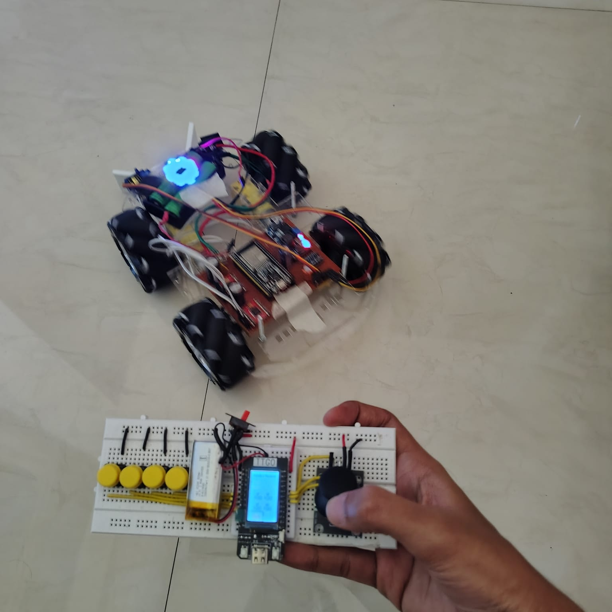

# ESP32 Mecanum Wheel Robot Car

A complete remote-controlled mecanum wheel robot car system using ESP32 microcontrollers with ESP-NOW wireless communication protocol.

[](https://www.youtube.com/watch?v=mn05_ho8lYk)
Click on image for video

## 📋 Overview

This project consists of two main components:
- **Experiment_car_copy**: The robot car controller (ESP32 DevKitC)
- **ESP_NOW_remote**: The wireless remote control (TTGO T-Display)

> 📖 **For detailed build process, issues encountered, and recommendations, see [BUILD_LOG.md](BUILD_LOG.md)**

This is a derived and enhanced version of the original mecanum wheel robot car designed by [DroneBot Workshop](https://dronebotworkshop.com). Special thanks to them for the excellent tutorial!

## 🚗 Features

### Robot Car (Experiment_car_copy)
- **4-Wheel Mecanum Drive System** with omnidirectional movement
- **6 Driving Modes**:
  - Standard Mode (full directional control)
  - Rotate Mode (in-place rotation)
  - Front/Rear Pivot Modes
  - Left/Right Pivot Modes
- **8 WS2812B RGB Status LEDs**:
  - Mode indicator (cyan/green/orange/violet/light blue/yellow)
  - Battery health indicator (green/yellow/red/flashing red)
  - Flapper mechanism indicator (indigo when active)
  - Speed limiter indicator (white/magenta)
  - Motor direction indicators (blue=forward, green=reverse, red=stopped)
- **Servo-controlled Flapper Mechanism** (kick action)
- **Real-time Battery Monitoring** with voltage divider
- **Motor Control**: TB6612FNG dual motor drivers
- **Watchdog Timer** for system stability
- **ESP-NOW Communication** with signal timeout protection

### Remote Control (ESP_NOW_remote)
- **TTGO T-Display Module** with integrated TFT screen
- **Analog Joystick Control** for precise movement
- **Multiple Display Modes**:
  - Graph mode (motor speed visualization)
  - Speed display mode
  - Compact mode (portrait orientation)
- **Speed Limiter Function** (adjustable maximum speed)
- **Battery Voltage Display** (both remote and car)
- **Real-time Motor Status** visualization
- **Mode Switching Buttons** (joystick button, rotate button)
- **Screen Toggle** functionality for power saving

## 🔧 Hardware Requirements

### Robot Car
- ESP32 DevKitC (or compatible)
- 2x TB6612FNG Motor Driver Modules (or L298N)
- 4x DC BO Motors with mecanum wheels
- 1x Servo motor (for flapper mechanism)
- 8x WS2812B NeoPixel LEDs
- 2S Li-ion Battery (7.4V nominal)
- Voltage divider circuit (100kΩ + 47kΩ resistors)
- LM2596 (for stepping down the voltage to 5V for ESP32, Neopixel, servo)

### Remote Control
- TTGO T-Display ESP32 Module
- Analog Joystick Module (X/Y axis + button)
- 4 Push buttons for additional controls
- Battery (3.7V LiPo)

## 📌 Pin Connections

### Car (ESP32 DevKitC)
```
Motors:
- Right Front: PWM=19, IN1=32, IN2=23
- Left Front:  PWM=26, IN1=33, IN2=25
- Right Rear:  PWM=27, IN1=12, IN2=14
- Left Rear:   PWM=4,  IN1=13, IN2=2

NeoPixels: Pin 5
Servo: Pin 18
Battery ADC: Pin 34
```

### Remote (TTGO T-Display)
```
Joystick:
- X-Axis: Pin 33
- Y-Axis: Pin 32
- Switch: Pin 12

Buttons:
- Flap: Pin 15
- Rotate: Pin 2
- Speed Limiter: Pin 13
- Display Mode: Pin 0 (built-in)
- Screen Toggle: Pin 35 (built-in)

Battery ADC: Pin 34
```

## 🚀 Getting Started

### Prerequisites
- [PlatformIO IDE](https://platformio.org/) (VS Code extension recommended)
- USB cable for programming
- Git (for cloning repository)

### Installation

1. **Clone the repository**
   ```bash
   git clone https://github.com/yourusername/mecanum-robot-car.git
   cd mecanum-robot-car
   ```

2. **Update MAC Addresses**
   - In `Experiment_car_copy/src/main.cpp`, update line 133:
     ```cpp
     uint8_t broadcastAddress[] = {0x08,0xD1,0xF9,0x6A,0x6E,0x94}; // Remote MAC
     ```
   - In `ESP_NOW_remote/src/main.cpp`, update line 68:
     ```cpp
     uint8_t broadcastAddress[] = {0xD4,0xE9,0xF4,0xA3,0x2F,0xF4}; // Car MAC
     ```
   
   *To find MAC address: Upload a simple sketch that prints `WiFi.macAddress()`*

3. **Install Required Libraries**
   
   Libraries are automatically managed by PlatformIO. Required dependencies:
   - NeoPixelBus (for WS2812B LEDs)
   - ESP-NOW (built-in)
   - TFT_eSPI (for remote display)

4. **Configure TFT_eSPI** (Remote only)
   - Copy `TFT_eSPI_Setup.h` to your TFT_eSPI library folder
   - Or modify `User_Setup.h` in the library for TTGO T-Display

5. **Upload Code**
   ```bash
   # For the car
   cd Experiment_car_copy
   pio run --target upload
   
   # For the remote
   cd ../ESP_NOW_remote
   pio run --target upload
   ```

## 🎮 Usage

### Remote Control Operation

**Joystick:**
- Move in any direction for mecanum wheel control
- Push button to cycle through all 6 modes

**Buttons:**
- **Rotate Button**: Quick cycle (Standard → Rotate → Front Pivot)
- **Flap Button**: Activate servo flapper mechanism
- **Speed Limiter**: Toggle speed restriction on/off
- **Display Mode**: Cycle through display layouts
- **Screen Toggle**: Turn display on/off for battery saving

### LED Indicators (Car)

**Status LEDs:**
- **NEO_STATUS (0)**: Current driving mode
  - Cyan = Standard, Green = Rotate, Orange = Front Pivot
  - Violet = Rear Pivot, Light Blue = Right Pivot, Yellow = Left Pivot
- **NEO_STATUS1 (2)**: Battery health
  - Green (>7.2V), Yellow (7.0-7.2V), Red (<7.0V), Flashing Red (<6.5V)
- **NEO_STATUS2 (4)**: Flapper status
  - Indigo = Active, Mode color = Idle
- **NEO_STATUS3 (6)**: Speed limiter
  - Magenta = Limited, Mode color = Normal

**Motor LEDs:**
- Blue = Forward, Green = Reverse, Red = Stopped

**Error State:**
- All LEDs turn RED when remote connection lost (>500ms timeout)

## 🔋 Battery Monitoring

The system monitors both car and remote battery voltages:
- Car: 2S Li-ion (7.4V nominal, 6.0V cutoff)
- Remote: 1S LiPo (3.7V nominal, 3.0V cutoff)

Voltage divider calculations are calibrated in code. Adjust `batteryConversionFactor` if readings are inaccurate.

## ⚙️ Configuration

### Speed Limiter
Adjust maximum speed in `ESP_NOW_remote/src/main.cpp`:
```cpp
const int speedLimitX = 100;  // 0-254 range
const int speedLimitY = 100;
```

### Servo Settings
Flapper servo parameters in `Experiment_car_copy/src/main.cpp`:
```cpp
const int kickAngle = 50;        // Kick position (degrees)
const long kickDelay = 500;      // Kick duration (ms)
const long kickCooldown = 50;    // Cooldown time (ms)
```

### LED Brightness
Reduce brightness by adjusting RGB values in color definitions (currently set to 20%).

## 🐛 Troubleshooting

**No Communication:**
- Verify MAC addresses are correct
- Check WiFi is not interfering
- Ensure both devices powered on
- Check serial monitor for ESP-NOW init errors

**Motors Not Moving:**
- Check motor driver connections
- Verify power supply is adequate (2A+ recommended)
- Test motor drivers independently
- Check PWM channel conflicts

**LEDs Not Working:**
- Verify NeoPixel power and ground
- Check data pin connection (Pin 5)
- Remove any resistors in power rail (causes voltage drop)
- Test with simple NeoPixel sketch

**Display Issues (Remote):**
- Verify TFT_eSPI configuration
- Check backlight control (Pin TFT_BL)
- Test display with TFT_eSPI examples

## 📝 Code Structure

### Experiment_car_copy
- ESP-NOW communication callbacks
- Motor control functions (6 modes)
- LED status management
- Battery monitoring
- Servo flapper control
- Watchdog timer implementation

### ESP_NOW_remote
- Joystick input processing with deadzone
- Button debouncing logic
- Display rendering (3 modes)
- ESP-NOW data transmission
- Battery voltage monitoring

## 🤝 Contributing

Improvements welcome! Areas for enhancement:
- PID-based speed control
- IMU integration for stability
- Obstacle detection sensors
- Autonomous navigation modes
- Mobile app integration

## 📄 License

This project is open source. Feel free to modify and distribute.

## 🙏 Acknowledgments

- Based on mecanum wheel robot tutorial by [DroneBot Workshop](https://dronebotworkshop.com)
- NeoPixelBus library by Michael C. Miller
- TFT_eSPI library by Bodmer
- ESP-NOW protocol by Espressif

## 📧 Contact

For questions or suggestions, please open an issue on GitHub.

---

**Happy Building! 🤖**
